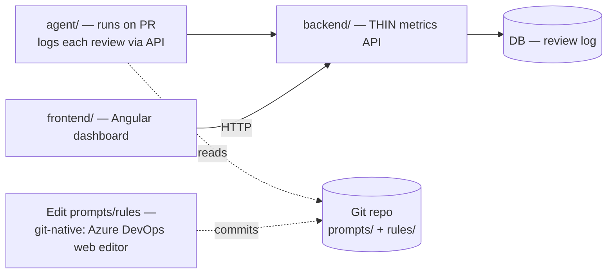

# CRUCIBLE — ADMIN APP

**Functional & Build Spec for Claude Code — V4**
The dashboard + configuration web app. Companion to **Crucible Agent Spec (V4)**, which covers the PR-review agent itself.
Owner: Stefan Biga · Org: Rationale (Azure DevOps + GitHub)
*V4 — the agent is now **multi-provider** (Azure DevOps + GitHub), so the dashboard gains a `provider` dimension (§3.1) and projects span both hosts; **self-serve "add a repo + grant access" onboarding** added as this app's **North Star** (§10). V3 set Angular + simplified to dashboard-first (editor/test = Phase 2b); V2 folded in RBAC, real-user commits, authenticated logging, optimistic concurrency, estimated-value labeling, shared taxonomy.*

---

## 0. Read this first — how the two specs fit

The Agent spec (V4) builds the reviewer that runs in CI (Azure DevOps or GitHub). **This** spec builds the app a Tech Lead/Admin uses to (1) see whether review is working and the value it delivers, and (2) tune prompts & rules per project.

**The prototype exposed a gap the V2 spec didn't cover:** the dashboard's numbers (PRs reviewed, time saved, severity trends) have to be *stored* and *served*. The V2 agent persists nothing. So this spec adds two pieces — a **database** and a **backend API** — and one new responsibility to the agent: **log every review**.

> **Agent spec impact (now reflected):** the agent gains a "write a review record" step — done via an **authenticated API endpoint**, not raw DB credentials in the pipeline (§3.3). The Agent spec is now **V4** (multi-provider); the schema and write-path are specified in §3 here.

---

## 1. Consolidated architecture



**Why this is simpler than it looks — and what we cut (answering "do we need so many layers?").** A multi-user dashboard showing *persisted* metrics has an irreducible shape: a **UI**, something that **stores** the data, and something that **serves** it securely. That's UI + API + DB — the floor for any reporting app, not over-engineering; you can't drop a layer and still have the dashboard. The extra weight in the earlier draft came from **two features**, not the core shape:

1. the **in-app prompt/rule editor** (needs a server-side git-write path + credentials), and
2. **test-on-sample-PR** (needs the Python review engine *inside* the backend).

Both are deferred to **Phase 2b**. For the first build:
- **Editing prompts/rules stays git-native** — the Azure DevOps web editor you already have, with full version history for free (Agent spec §13). No editor UI, no commit-via-API.
- The backend is **thin**: ingest review logs, serve aggregated metrics. It shares **nothing heavy** with the agent — no review engine, no git-writes.
- Net: **three lean parts** — the **agent** (built in Phase 1), a **thin API + small DB**, and the **Angular dashboard**.

*Phase 2b (later, optional):* the in-app Configuration editor (§5.4–5.5) + test-on-sample-PR. They re-introduce a git-write path and the review engine into the backend — which is exactly why they're out of the first build.

**Monorepo layout** (refines the Agent spec's structure — `crucible/` package generalizes to `core/`; nothing is built yet, so this is the moment to set it up right):

```
crucible/
├── core/                 # shared by agent + backend — NO duplication
│   ├── reviewer.py        # the review engine (called by both pipeline + test endpoint)
│   ├── llm.py             # LiteLLM provider-agnostic call
│   ├── diff.py            # unified-diff parser
│   ├── azure_client.py    # Azure DevOps REST (post comments, read/write files, git history)
│   ├── prompt_builder.py
│   ├── db.py              # SQLAlchemy models + session (review log)
│   └── metrics.py         # time-saved / cost calculations
├── agent/
│   ├── main.py            # pipeline entrypoint (uses core) + logs review to DB
│   └── azure-pipelines-crucible.yml
├── backend/              # THIN — metrics only in the first build
│   ├── app.py             # FastAPI app (serve metrics + ingest agent review logs)
│   ├── routes/            # metrics  (config + review-test = Phase 2b)
│   └── auth.py
├── frontend/             # Angular (Angular CLI) + ngx-charts  ← built from the prototype as visual reference
│   └── (see §6)
├── prompts/  rules/      # content layer — read by the agent; edited git-native (Phase 2b: via the API)
├── config.yaml
└── docs/
    ├── CRUCIBLE_AGENT_SPEC.md   # V4
    └── CRUCIBLE_ADMIN_SPEC.md   # this file, V4
```

---

## 2. Tech stack & the two decisions

| Layer | Choice | Why | Override |
|---|---|---|---|
| **Frontend** | **Angular (Angular CLI) + Angular Material (or custom) + ngx-charts** | Your decision — matches the Rationale stack so the Focus dev team can own it natively. The Claude Design prototype is a **visual reference**, not code reuse (it exports React) | — (React was the build-speed alternative) |
| **Backend** | Python / FastAPI — **thin (metrics only) in the first build** | One ecosystem with the agent; no review engine needed until Phase 2b | Supabase (collapses API+DB+auth, adds a non-Microsoft dependency); or a .NET minimal API if the dev team takes ownership |
| **DB** | Postgres (SQLite for local dev) | Multi-user org tool with 10+ projects | — |
| **Charts** | **ngx-charts** (native Angular) | Covers every chart in the prototype with Angular-native components | ECharts via `ngx-echarts` for richer interactivity |
| **Auth + RBAC** | Entra SSO + two roles — **Viewer** (dashboards) and **Admin** (edit prompts/rules/settings), enforced **server-side** (Phase 7) | Org tool on Microsoft identity; changing review behavior must be gated | — |

---

## 3. The data layer (NEW — build the contract first)

### 3.1 Review-log schema (`reviews` + `findings`)

The agent writes one `reviews` row per PR review, plus N `findings` rows. Everything on the dashboard aggregates from these.

```
reviews
  id              uuid pk
  project         text            -- canonical repo key, e.g. "Focus.Api" or "acme-org/acme-web"
  provider        text            -- "azure" | "github"  (the host this PR lives on)
  pr_id           int
  pr_title        text
  created_at      timestamptz
  model_used      text            -- e.g. "anthropic/claude-sonnet-4-6"
  diff_lines      int
  findings_total  int
  crit / high / med / low   int   -- severity counts
  blocked_merge   bool
  duration_sec    int             -- how long the review took
  est_cost_usd    numeric
  est_time_saved_min  int         -- see 3.2

findings
  id            uuid pk
  review_id     uuid fk -> reviews.id
  rule          text     -- short rule name, powers the "most-flagged rules" leaderboard
  severity      text     -- critical | high | medium | low
  category      text     -- bug | security | performance | test | maintainability | style
  file          text
  line          int
  message       text
```

> **`severity` and `category` are the canonical enums from `core/models.py` — shared verbatim with the agent.** Never store a value outside the set, or the dashboard's charts and filters break (gap X-01). `project` is the one canonical repo key used in logs, config mapping, and dashboard (gap X-03). **`provider`** lets the dashboard span Azure DevOps + GitHub repos in one view and offer a host filter/badge; the all-projects table shows a small provider icon per row.

### 3.2 Time-saved formula (configurable — it's a directional ROI metric, not precise)

```
est_time_saved_min  =  BASE_PR_MIN  +  (findings_total × MIN_PER_FINDING)
defaults: BASE_PR_MIN = 6,  MIN_PER_FINDING = 4
```

Put the coefficients in `config.yaml` so you can defend/adjust them. Aggregate to hours for the dashboard. This feeds your day-1 / day-30 / day-90 ROI framing.

**These are estimates — the UI must label them as such** ("estimated", with the assumptions visible on hover/info). Don't present *time saved* / *cost* as exact figures to execs (gap P2-05).

**`est_cost_usd`** is computed from a per-model **price table in `config.yaml`** (input/output $ per 1M tokens) with a `prices_updated:` date — model prices change, so this table is a documented maintenance item (gap P2-06).

### 3.3 API endpoints (FastAPI, `backend/`)

| Method · Path | Auth | Purpose |
|---|---|---|
| `GET /metrics/org?range=30d` | Viewer | Org KPIs + chart series + the all-projects table |
| `GET /metrics/project/{name}?range=30d` | Viewer | Project KPIs + charts + most-flagged-rules + recent reviews |
| `GET /config/{project}/files` | Viewer | List prompt/rule files with current version |
| `GET /config/{project}/file?path=` | Viewer | File content **(+ its current git SHA)** + history |
| `PUT /config/{project}/file` | **Admin** | Save → commit via Azure DevOps REST, **authored by the logged-in user**, message = the change note. Body carries the **git SHA seen at load**; reject with **409** if it changed underneath (optimistic concurrency — P2-02/04) |
| `GET /config/{project}/file/history?path=` | Viewer | Version list + diffs |
| `POST /review/test` | **Admin** | Dry-run review on a chosen PR/diff with current (optionally unsaved) prompts/rules → findings. Calls `core/reviewer.py`. **Size-capped; diff treated as untrusted** (P2-11) |
| `POST /reviews` | **Agent token** | The agent logs a review record here — **not raw DB creds in the pipeline** (P2-03) |

**The repo stays the single source of truth for prompts/rules** — the API edits files via git commit, exactly as the Agent spec requires. The DB is *only* for review metrics. **Every endpoint is authorized** (Viewer vs Admin); the agent authenticates with a dedicated token.

---

## 4. Design source of truth

The Claude Design prototype is the visual contract. **Before building:** put the design into the repo at `crucible/frontend/design/` — either Claude Design's exported code, or high-resolution screenshots of each screen named `01-dashboard-org.png`, `02-dashboard-project.png`, `03-config.png`, `04-panels.png`. Claude Code matches the build to these; screenshots alone are enough.

**Design tokens (recap — Claude Code must use these):** dark-first; bg `#0D0E11`, surface `#16181D`, border `#262A31`, text `#E6E8EB`, muted `#8B919B`; brand ember `#F97316` (sparingly); severity Critical `#EF4444` / High `#F59E0B` / Medium `#EAB308` / Low `#64748B` (labeled badges, kept distinct from the ember accent). Inter for UI, a monospace for editors/metrics. One color signal per card; underline tabs not pills; sidebar nav, no FABs.

---

## 5. Screen-by-screen functional spec

For each screen: **components**, **data** (from §3.3), **states**, **interactions**. Build every state — `empty`, `loading` (skeletons), `error`, `populated`.

### 5.1 Shell (every screen)
- **Components:** left sidebar (ember logo mark → global **project switcher** → nav: Dashboard, Configuration, Activity, Settings).
- **Data:** project list (from `/metrics/org`).
- **Interactions:** project switcher scopes every page; switching to a project routes Dashboard→project view and Configuration→that project's config.

### 5.2 Dashboard / Organization (default landing — switcher = "All Projects")
- **Components:** date-range segmented control (7/30/90, underline-active); 5 KPI cards (PRs Reviewed, Issues Caught, **Time Saved** = hero/ember, API Cost, Avg Review Time); area chart (PRs reviewed + cumulative time saved); severity donut; all-projects table (Project · PRs · Issues · Time Saved · Top Severity badge · Status pill · 7-day sparkline).
- **Data:** `GET /metrics/org?range=`.
- **Interactions:** date range re-queries; **clicking a table row → 5.3 for that project**.

### 5.3 Dashboard / Single Project
- **Components:** same KPI cards (scoped); line chart (PRs over time); horizontal bar (findings by category); stacked bar (severity trend); **most-flagged-rules leaderboard**; **recent-reviews feed** (rows: `PR #1432 · 4 findings (1 critical) · blocked merge · 2h ago`).
- **Data:** `GET /metrics/project/{name}?range=`.
- **Interactions:** recent-review row → (Phase 7) deep link to the PR in Azure DevOps.

### 5.4 Configuration (per selected project)
- **Components:** underline tabs — **Prompts · Global Rules · Project Rules · Language Rules · Settings**. Each editor item is a card: title, **version badge (V3)**, "Updated 3 days ago by …", monospace editor, footer with a "What changed & why" note input, **Save** (ember), "View history", "Test on a sample PR".
  - Prompts → System / Review / Summary editors.
  - Project Rules → one editor (.NET/SQL/Redis rules).
  - Language Rules → chips (C#, TypeScript, Angular, SQL) → loads that editor.
  - Settings → provider/model dropdown (Claude Sonnet 4.6 / Gemini 2.5 Pro / GPT-5), min-severity-to-post, fail-check-on, max-diff-lines, excluded-paths list.
- **Data:** `GET /config/{project}/files`, `…/file`.
- **Interactions:** tabs switch editor groups; Save → `PUT …/file` → toast + version bumps. **Editing is Admin-only — Viewers get a read-only view.** Save sends the git SHA seen at load; if the file changed underneath (another admin saved first), show a **conflict warning and reload** rather than overwrite. The commit is **authored by the logged-in user**. "View history" → 5.5a; "Test" → 5.5b.

### 5.5 Side panels
- **a) Version history:** right panel, version list V1→V3 (date, author, change note) → select shows added/removed diff → "Restore this version". Data: `GET …/file/history`.
- **b) Test on a sample PR:** right panel, pick a recent PR or paste a diff → shows findings the *current unsaved* prompts/rules would produce (severity badge · file · line · message). Data: `POST /review/test`.

---

## 6. Frontend structure (`crucible/frontend/` — Angular CLI workspace)

```
frontend/
├── design/                       # exported screens / screenshots — visual source of truth
├── src/app/
│   ├── core/        ApiService, typed models, HTTP interceptors, auth guard
│   ├── shell/       sidebar, project-switcher, top-bar components
│   ├── pages/       dashboard-org, dashboard-project   (configuration = Phase 2b)
│   ├── components/  kpi-card, area-trend, severity-donut, category-bar,
│   │                severity-trend, projects-table, rules-leaderboard,
│   │                recent-reviews, severity-badge
│   └── mocks/       mock fixtures for the mock-data phase
├── src/styles/      design tokens (SCSS / CSS variables)
└── angular.json
```

Map the prototype's screens to Angular components 1:1. State via services + signals (or a light store); charts via `ngx-charts`. Tokens from §4 live as CSS variables in `src/styles`.

---

## 7. Phased build plan for Claude Code

> **plan.md gate (Forge-style):** Claude Code produces `plan.md` and **stops for your approval before any code**. Then one phase at a time, each with an acceptance test you run before continuing.
>
> **Sequencing rationale:** the Angular dashboard on mock data ships *first* so you get a clickable, validate-able app fast and confirm it matches the prototype *before* any backend. Then a thin backend, wire it up, lock auth, ship. The in-app editor + test-review are **Phase 2b** — deferred, because they're the heavy bits (§1).

**First build (the dashboard):**

| Phase | Build | ✅ Acceptance test |
|---|---|---|
| **0 — Scaffold** | Angular CLI workspace; design tokens in `src/styles`; import `design/`; static shell (sidebar, project switcher, nav, routing) | Shell renders, nav + project switcher work, matches tokens |
| **1 — Dashboards (mock)** | Build 5.2 + 5.3 (org + project) to match the prototype, fed by `mocks/`; charts via ngx-charts | Both dashboards render with charts + tables matching the design; switcher, date range, row drill-down work |
| **▸ Milestone** | Clickable dashboard on mock data | **Eyeball it against the prototype. Fix visuals now, before backend.** |
| **2 — Data layer** | Thin FastAPI + Postgres + §3.1 schema using the **canonical enums from `core/models.py`**; agent logs via the **authenticated `POST /reviews`** (no DB creds in the pipeline); cost via the price table | Agent run on a test PR writes a row **via the API**; `GET /metrics/org` returns real aggregates with correct enum buckets |
| **3 — Wire dashboards** | Replace mocks with the real API (`ApiService`) | Dashboards show real DB data; ranges/filters query the API |
| **4 — Auth, RBAC + hardening** | Entra SSO + **RBAC (Viewer/Admin) server-side**; empty/loading/error states; PR deep links; DB backups; deploy internally. **Do not expose the app before this phase.** | Login required; Viewer is read-only; states handled; deployed with backups — **Phase 2 ships here** |

**Phase 2b — deferred enhancement (in-app maintenance):**

| Phase | Build | ✅ Acceptance test |
|---|---|---|
| **5 — Config editor** | Build 5.4 + 5.5a; read/save prompts & rules via Azure DevOps REST; **commits authored by the real user**; **optimistic concurrency** (git SHA); version history | Save commits **as the logged-in user**; a stale-SHA save is rejected with a conflict warning; history shows real versions + diffs; restore works |
| **6 — Test-on-sample-PR** | Build 5.5b; `POST /review/test` runs `core/reviewer.py` in dry-run; **admin-only, size-capped, diff treated as untrusted** | Test panel returns real findings from current unsaved prompts/rules; a Viewer cannot call it |

---

## 8. Claude Code kickoff prompt (paste this to start)

```
Read docs/CRUCIBLE_AGENT_SPEC.md (V3) and docs/CRUCIBLE_ADMIN_SPEC.md (V3), and look
at every image/export in frontend/design/. Together they specify "Crucible": a PR-review
agent (Python, runs in Azure DevOps) plus an admin web app (Angular) for dashboards and
for maintaining the agent's prompts & rules across 10+ projects.

You are building the ADMIN APP and its thin backend, per the Admin spec. Build the
"First build (the dashboard)" phases 0–4. Phase 2b (config editor + test-review) is deferred.

Before writing any code:
1. Produce plan.md — file-by-file, in the phase order from Admin spec §7, with the
   acceptance test for each phase.
2. Flag anything ambiguous or that you'd do differently, with your recommendation —
   especially the data contract (§3) and how the agent's logging step fits the existing agent.
3. STOP and wait for my approval of plan.md. Do not write code yet.

After approval, build ONE phase at a time. End each phase by telling me the exact
command(s) to verify it, and wait for me to confirm before the next phase.

Hard constraints:
- Match the design in frontend/design/ closely — tokens in Admin spec §4. Build every
  state: empty, loading (skeletons), error, populated.
- Phases 0–1 use mock data only. Do not build the backend until Phase 2.
- The first-build backend is THIN (metrics only) and shares nothing heavy with the agent.
  (Phase 2b's /review/test endpoint MUST reuse core/reviewer.py — never duplicate review logic.)
- RBAC, server-side: GET metrics = Viewer; editing config + /review/test = Admin. The UI
  hides edit controls for Viewers, but the API is the real gate. Do not expose the app before auth (Phase 4).
- Config saves (Phase 2b) are AUTHORED BY THE LOGGED-IN USER (commit author + message = user + change note)
  and use optimistic concurrency: include the git SHA seen at load; reject a stale save with a 409 — never silently overwrite.
- The agent logs reviews via the authenticated POST /reviews endpoint — never raw DB creds in the pipeline.
- Reuse the canonical severity/category enums from core/models.py — never invent values; they must match the agent exactly.
- time-saved and cost are ESTIMATES — label them as such in the UI and surface the assumptions.
- The repo (prompts/ + rules/) stays the single source of truth; editing is git-native in the
  first build (Phase 2b adds in-app editing via the API). The DB holds review metrics only.
- All LLM calls go through core/llm.py (LiteLLM) — never a provider SDK, never hard-code a vendor.
```

---

## 9. What to do right now (before running Claude Code)

1. **Export the prototype** into `crucible/frontend/design/` — Claude Design code export if available, otherwise high-res screenshots of each screen.
2. **Confirm the two decisions** in §2 (or override) — baked into this spec as **Angular + thin FastAPI + Postgres**.
3. **Drop both specs** into `docs/` and the screenshots into `frontend/design/`.
4. **Run the kickoff prompt** (§8) → approve `plan.md` → build phase by phase.

*This is V4. New content revisions increment: V5, V6, … Vn.*

---

## 10. North Star — self-serve repo onboarding (a later phase)

The endgame for the whole product: an admin **adds a repository and grants access** right here in the Admin app, and Crucible starts reviewing its PRs — **no committed CI config per repo**. A "Repositories" admin section would let you connect a host (install the **GitHub App** / authorize the **Azure DevOps OAuth app**), pick repos, assign rule sets, and toggle review on.

**Why it's a later phase, not now:** it requires a **hosted webhook service** that receives PR events and runs the review — which reverses the Phase-1 "no server, runs in CI" decision. It's a different deployment shape, built once the CI-based version is proven. The *same* `core/` review engine and `GitProvider` adapters power it; only the **trigger** changes from CI to webhooks (Agent Spec §14).

**What it unlocks:** Crucible becomes a product — any team defines a repo and grants access rather than wiring CI by hand. Until then, onboarding a repo is the Agent Spec's per-repo CI setup, and this dashboard just *reports* on what's connected.
